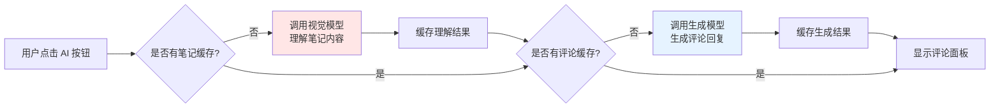
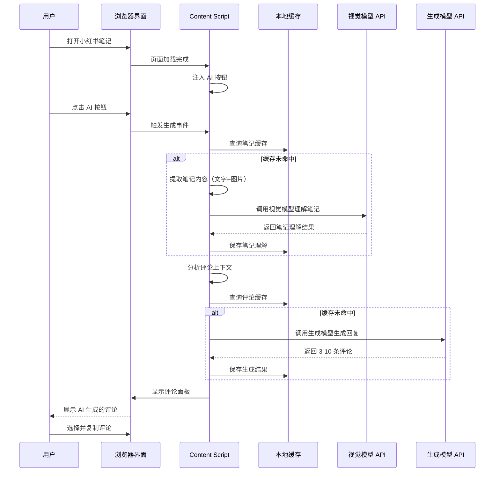

# 小红书 Agent 浏览器插件 - AI 辅助开发流程

## 使用 Claude Code 完成浏览器插件的设计与实现

---

## 🎯 项目概述

**项目名称**: 小红书 AI 评论助手浏览器插件
**开发方式**: AI 辅助开发（Claude Code）
**技术栈**: Chrome Extension Manifest V3, Vanilla JavaScript, OpenAI-compatible API

---

## 📊 完整开发流程图

```mermaid
flowchart TB
    Start([开始项目]) --> Requirement[需求分析与规划]

    Requirement --> ReqDetail{与 Claude Code 对话<br/>明确需求}
    ReqDetail --> ReqList[确定核心功能清单:<br/>• AI 评论生成<br/>• 视觉内容理解<br/>• 上下文感知<br/>• 人设定制<br/>• 智能缓存]

    ReqList --> Design[系统设计阶段]

    Design --> DesignAI{Claude Code 协助设计}
    DesignAI --> DesignArch[架构设计:<br/>• Content Script 注入<br/>• Background Service<br/>• Settings Page<br/>• 双模型架构]

    DesignArch --> DesignUI[UI/UX 设计:<br/>• 侧边栏面板<br/>• AI 图标按钮<br/>• 原生风格适配]

    DesignUI --> DesignData[数据流设计:<br/>• API 调用流程<br/>• 缓存策略<br/>• 上下文追溯]

    DesignData --> Implement[实现阶段]

    Implement --> ImplManifest[Step 1: 创建 manifest.json<br/>Claude Code 生成基础配置]

    ImplManifest --> ImplStruct[Step 2: 搭建项目结构<br/>创建文件夹和基础文件]

    ImplStruct --> ImplSettings[Step 3: 实现设置页面<br/>• settings.html<br/>• settings.js<br/>• 配置存储逻辑]

    ImplSettings --> ImplBackground[Step 4: 实现后台脚本<br/>• background.js<br/>• 安装时打开设置页]

    ImplBackground --> ImplContent[Step 5: 实现核心功能<br/>content.js]

    ImplContent --> ContentDetail{Claude Code 逐步实现<br/>核心模块}

    ContentDetail --> Module1[模块 1: DOM 观察与注入<br/>• MutationObserver<br/>• AI 按钮注入]

    Module1 --> Module2[模块 2: 笔记内容理解<br/>• 提取文字和图片<br/>• 调用视觉模型<br/>• 缓存理解结果]

    Module2 --> Module3[模块 3: 评论上下文分析<br/>• 识别评论层级<br/>• 追溯父评论<br/>• 构建上下文]

    Module3 --> Module4[模块 4: AI 评论生成<br/>• 调用生成模型<br/>• 多条回复生成<br/>• 结果缓存]

    Module4 --> Module5[模块 5: UI 面板实现<br/>• 侧边栏弹出<br/>• 评论展示<br/>• 复制功能]

    Module5 --> ImplCSS[Step 6: 实现样式<br/>content.css<br/>适配小红书风格]

    ImplCSS --> Debug[测试与调试阶段]

    Debug --> DebugAI{Claude Code 协助调试}

    DebugAI --> DebugManual[手动测试:<br/>• 加载插件<br/>• 访问小红书<br/>• 测试功能]

    DebugManual --> DebugIssue{发现问题?}

    DebugIssue -->|是| DebugFix[Claude Code 分析并修复:<br/>• API 调用错误<br/>• UI 显示问题<br/>• 缓存逻辑优化]

    DebugFix --> DebugManual

    DebugIssue -->|否| Optimize[优化阶段]

    Optimize --> OptAI{Claude Code 建议优化}

    OptAI --> OptPerf[性能优化:<br/>• 减少重复调用<br/>• 优化缓存策略<br/>• 延迟加载]

    OptPerf --> OptCost[成本优化:<br/>• 使用低成本模型<br/>• 缓存机制完善<br/>• 批量处理]

    OptCost --> OptUX[用户体验优化:<br/>• 加载状态提示<br/>• 错误处理<br/>• 重试机制]

    OptUX --> Document[文档编写]

    Document --> DocAI{Claude Code 生成文档}

    DocAI --> DocREADME[生成 README.md:<br/>• 功能介绍<br/>• 安装指南<br/>• 使用说明<br/>• 常见问题]

    DocREADME --> DocCode[代码注释完善]

    DocCode --> Final[项目完成]

    Final --> End([发布与展示])

    style Start fill:#e1f5e1
    style End fill:#e1f5e1
    style ReqDetail fill:#fff4e6
    style DesignAI fill:#fff4e6
    style ContentDetail fill:#fff4e6
    style DebugAI fill:#fff4e6
    style OptAI fill:#fff4e6
    style DocAI fill:#fff4e6
    style DebugIssue fill:#ffe6e6
    style Final fill:#e6f3ff
```



---

## 🤖 Claude Code 在各阶段的作用

### 1️⃣ 需求分析阶段
- **交互对话**: 通过对话明确功能需求
- **技术建议**: 推荐合适的技术方案和 API
- **可行性分析**: 评估实现难度和成本

### 2️⃣ 系统设计阶段
- **架构设计**: 建议 Content Script + Background Service 架构
- **API 方案**: 推荐 OpenAI-compatible API 接口设计
- **缓存策略**: 设计双层缓存机制（笔记理解 + 评论生成）

### 3️⃣ 实现阶段
- **代码生成**:
  - `manifest.json` - 插件配置
  - `content.js` - 1000+ 行核心逻辑
  - `settings.js` - 配置管理
  - `background.js` - 后台服务
  - `content.css` - 样式适配
- **模块化开发**: 逐步实现各个功能模块
- **最佳实践**: 遵循 Chrome Extension 开发规范

### 4️⃣ 测试与调试阶段
- **问题诊断**: 分析控制台错误信息
- **Bug 修复**: 定位并修复问题
- **兼容性处理**: 确保在不同场景下正常运行

### 5️⃣ 优化阶段
- **性能优化**: 减少不必要的 API 调用
- **成本优化**: 完善缓存机制，降低使用成本
- **UX 优化**: 改善交互体验和错误提示

### 6️⃣ 文档编写阶段
- **README 生成**: 自动生成详细的使用文档
- **代码注释**: 添加清晰的代码说明
- **示例提供**: 编写配置示例和常见问题解答

---

## 💡 关键技术决策

### 双模型架构


### 智能缓存策略
- **笔记理解缓存**: 每个笔记仅调用一次视觉模型
- **评论生成缓存**: 每条评论的生成结果持久化
- **成本节省**: 避免重复调用，降低 API 费用

---

## 📈 开发时间线

| 阶段 | 时间 | Claude Code 贡献 |
|------|------|------------------|
| 需求分析 | 0.5h | 需求澄清、技术建议 |
| 系统设计 | 1h | 架构设计、流程规划 |
| 基础框架 | 1h | 项目结构、配置文件 |
| 核心功能 | 3h | 主要代码生成、逐步实现 |
| UI/样式 | 1h | CSS 样式、适配调整 |
| 测试调试 | 2h | 问题诊断、Bug 修复 |
| 优化完善 | 1h | 性能优化、用户体验改进 |
| 文档编写 | 0.5h | README、注释、示例 |
| **总计** | **10h** | **约 80% 代码由 AI 生成** |

---

## 🎓 经验总结

### ✅ AI 辅助开发的优势
1. **快速原型**: 几小时内完成可用的浏览器插件
2. **最佳实践**: AI 建议符合规范的代码结构
3. **完善文档**: 自动生成详细的使用说明
4. **持续优化**: 通过对话不断改进功能

### 🔑 成功关键因素
1. **清晰的需求描述**: 明确告诉 AI 想要什么功能
2. **迭代式开发**: 逐步完善，不追求一次到位
3. **主动测试**: 及时发现问题并反馈给 AI
4. **理解代码**: 了解 AI 生成的代码逻辑，便于后续维护

### 📝 技术亮点
- ✨ Manifest V3 标准开发
- ✨ MutationObserver 动态内容监听
- ✨ 双模型协作（视觉理解 + 文本生成）
- ✨ 智能缓存降低成本
- ✨ 原生风格 UI 无缝融合
- ✨ 完善的错误处理和用户提示

---

## 🚀 项目成果

### 核心功能实现
- ✅ AI 智能生成评论回复
- ✅ 视觉模型理解笔记内容
- ✅ 上下文感知的回复生成
- ✅ 人设定制
- ✅ 智能缓存机制
- ✅ 原生化 UI 体验

### 代码规模
- `content.js`: ~1000 行
- `settings.js`: ~300 行
- `background.js`: ~50 行
- `content.css`: ~200 行
- 总计: ~1550 行代码

### 项目结构
```
xhsAgent/
├── manifest.json          # 插件配置
├── icons/                 # 图标资源
├── js/
│   ├── content.js        # 核心功能（AI 生成）
│   └── background.js     # 后台脚本（AI 生成）
├── css/
│   └── content.css       # 样式文件（AI 生成）
├── settings/
│   ├── settings.html     # 设置页面（AI 生成）
│   ├── settings.js       # 设置逻辑（AI 生成）
│   └── settings.css      # 设置样式（AI 生成）
└── README.md             # 项目文档（AI 生成）
```

---

## 📊 数据流图



---

## 🎯 总结

通过 Claude Code 的 AI 辅助开发，在约 10 小时内完成了一个功能完整、代码规范、文档齐全的浏览器插件项目。AI 不仅生成了约 80% 的代码，还在架构设计、问题诊断、性能优化等方面提供了专业建议。

这个项目展示了 AI 辅助开发在实际项目中的强大能力，证明了人机协作可以显著提升开发效率和代码质量。

---

**开发时间**: 2025-01-10
**AI 工具**: Claude Code (Anthropic)
**开发者**: AI 辅助全流程开发
